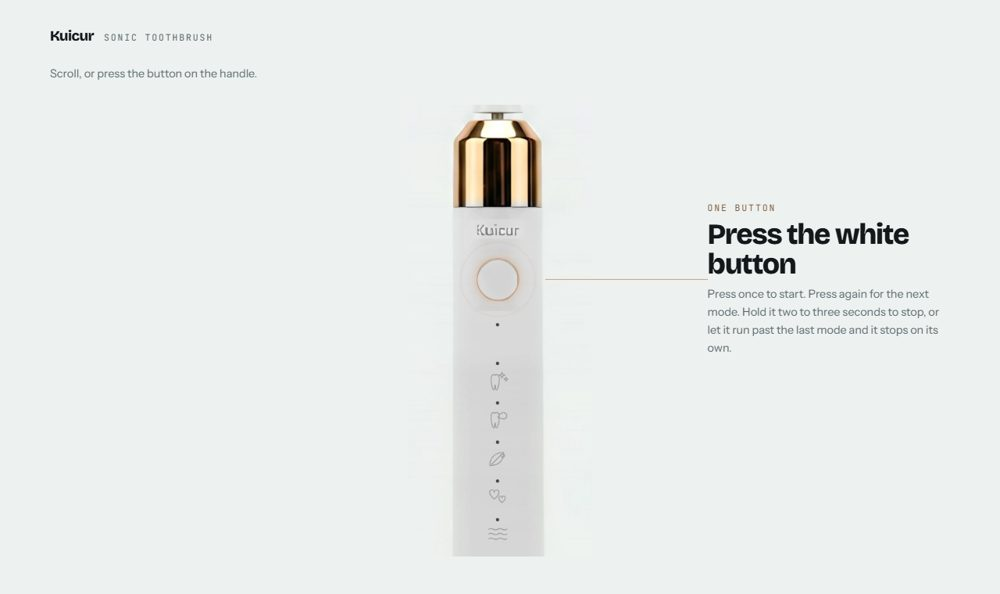

# Kuicur Sonic Toothbrush

<!-- badges -->
[](https://github.com/YuraItDeveloper14/kuicur-toothbrush/actions/workflows/check.yml) [](LICENSE) [](https://github.com/YuraItDeveloper14/kuicur-toothbrush/commits)

<!-- preview -->
<p align="center">
  
</p>

A single-page product site for the Kuicur-White sonic toothbrush, built around
one photograph of the handle. Static HTML, CSS and vanilla JavaScript — no
framework, no build step, no dependencies.

**Live:** https://kuicur-toothbrush.vercel.app

## Running it

Nothing to install. Serve the folder:

```bash
python -m http.server 4321
```

Then open http://localhost:4321. Opening `index.html` straight from the file
system works too, apart from the fonts.

## How the page is put together

**The handle tour** is one camera move over a single photograph. The section is
eight viewports tall; a sticky stage holds the picture while `scroll.js` writes
how far it has travelled onto the section as `--p`, and CSS does the rest. The
camera has four framings — the head, the button, the column of modes, and the
mark at the foot — and the beat decides which one is showing.

Everything drawn over the photograph sits in the photograph's own coordinates,
measured off the source file and written as percentages, so it stays put at any
size:

- the mode icons and the indicator holes (`.tour__print`), redrawn as SVG
  because the printing was already lost to compression before the photo arrived
- the lights that come on, one at a time
- the power button, which is a real `<button>` sitting exactly on the printed
  one; pressing it steps through the modes the way the real one does

**The strip** is seven frames that travel sideways while the page scrolls down.
Each opens a `<dialog>` with something different to play with — a counter
running at the motor's real rate, ninety days that drain, a charge you hold a
button for, a timer that runs itself.

**Reduced motion** is not an afterthought: `prefers-reduced-motion: reduce`
collapses every pinned section to its resting state and lays the strip out as a
grid, so the whole page is still readable with nothing moving.

## Rebuilding the images

`assets/img/handle-shot.webp` is generated, not hand-edited. The source is a
phone photograph, and the script does the work that makes it sit on the page:

```bash
python tools/build-handle-shot.py     # the handle
python tools/build-kit-shot.py        # the kit photograph
```

`build-handle-shot.py` flattens the background onto the page colour so the
handle floats with no visible frame, takes the colour cast off the body while
leaving the collar gold, wipes the printed strip back to bare cylinder, grows
the image in halving steps and then runs iterative back-projection so the
enlargement stays consistent with the source. Framing is held as fractions of
the source, so a larger original can be dropped in and the script rerun with
nothing to re-measure.

## About the figures

Every number on the page comes from Kuicur's own published material — the user
manual for model Kuicur-White and the Amazon listing for ASIN B0DGWW1YKH. The
page says where they come from and does not round them in the product's favour.

One thing is deliberately **not** claimed: the green colourway's listing
advertises IPX8, but the white model's manual asks you not to leave the handle
immersed, so this page does not describe it as submersible.

Where a demo plays something back faster than real time, the panel says so.

## Credits and licences

The photograph of the handle was taken by the owner. The kit photograph in the
closing section comes from the Amazon listing.

The three typefaces — Bricolage Grotesque, Instrument Sans and JetBrains Mono —
are under the SIL Open Font Licence and are served from this repository rather
than from a third party, so the page makes no off-origin requests.

This is an independent page. It is not affiliated with Kuicur.
